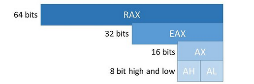
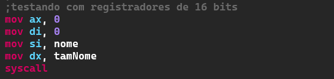
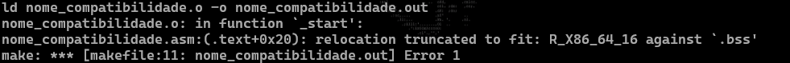

### os sistemas com arquitetura x86_64  permitem o uso dos registradores de 32 bits sem que ocorra alteracao do funcionamento do programa

### testando com 16 bits

### resultando em incompatibilidade(truncado)

